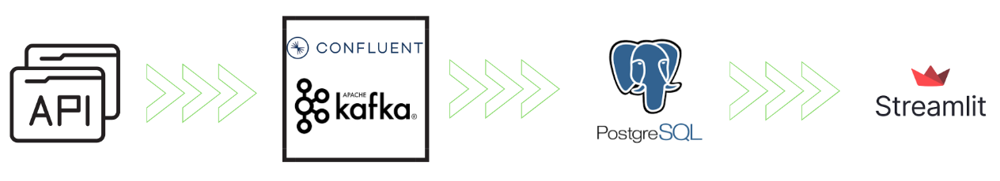
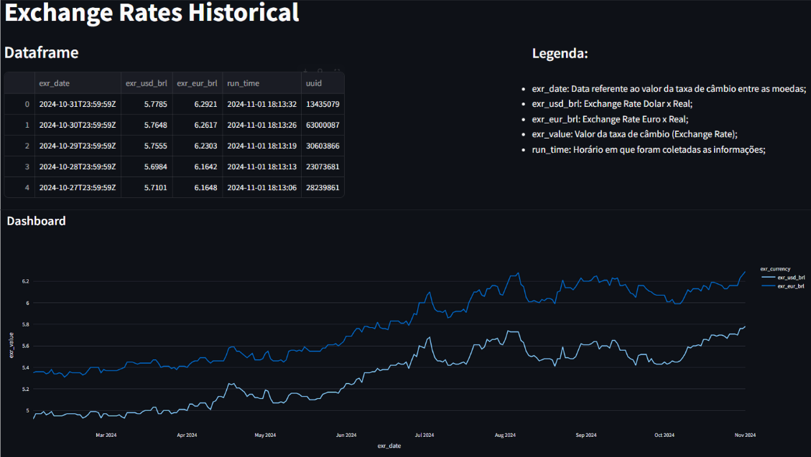

# Explicação do Projeto

Este projeto visa praticar conceitos de filas e mensageria de dados com o Apache Kafka, utilizando o Confluent Kafka.

A solução foi organizada da seguinte forma:

1) **Coleta dos Dados da API**  
   No primeiro passo, foi necessário estudar a documentação da API para entender seu funcionamento.  
   Documentação da API: [link para documentação](https://currencyapi.com/docs/)

2) **Configuração do Kafka**  
   Utilizando o [Confluent Kafka](https://www.confluent.io/cloud-kafka/), foi criado um cluster Kafka e configurado um tópico. Após essa etapa, foram implementados o producer e o consumer.  
   Repositório auxiliar para utilização do Kafka: [link para GitHub](https://github.com/lvgalvao/kafka-workshop)

3) **Persistência de Dados no Banco**  
   Com os dados armazenados no broker Kafka, foi configurado um consumer para o tópico onde as informações estão armazenadas. Em seguida, utilizando o Render, foi criado um banco de dados PostgreSQL para persistência dos dados.

4) **Construção do Dashboard**  
   Por fim, os dados foram consumidos do banco de dados PostgreSQL hospedado no Render e, utilizando o Streamlit, foi criado um dashboard para visualização. Algumas transformações simples foram feitas nos dados para a criação do gráfico.  
   Documentação do Streamlit: [link para documentação](https://docs.streamlit.io/)

### Arquitetura da Solução  


### Dashboard Final  


---

# Como rodar o projeto utilizando Docker

1) Clone o repositório;
2) Baixe o Docker: [instruções para instalação no Windows](https://docs.docker.com/desktop/install/windows-install/);
3) Consulte a documentação da API para obter sua API_KEY: [link para documentação](https://currencyapi.com/docs/);
4) No terminal, navegue até a pasta `exchange_rate_docker` e execute o comando:  
   ```bash
   docker compose build
5) Após o build, execute o comando:
   ```bash
    docker compose up -d